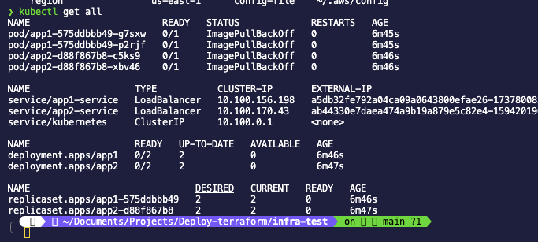
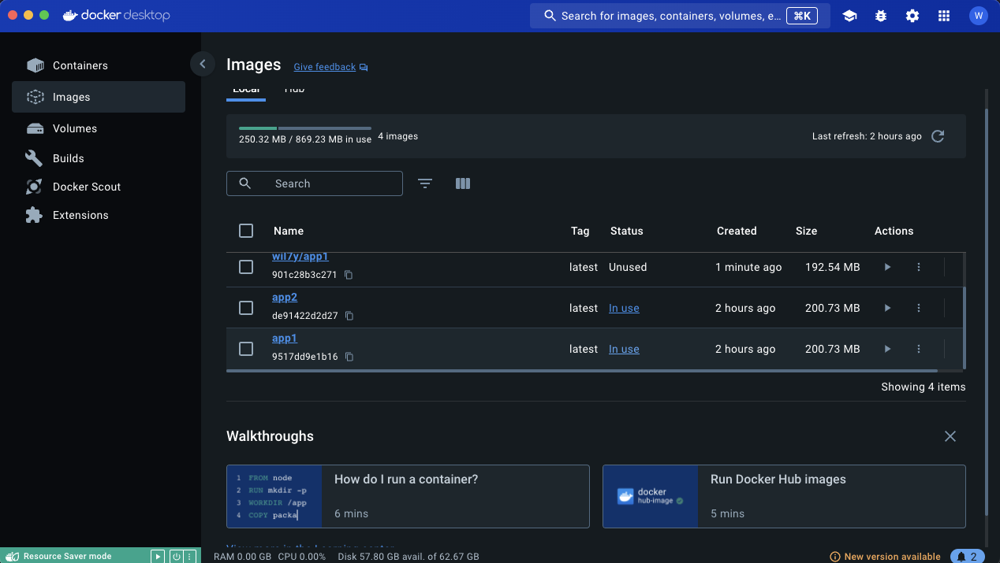

# **Project: Deployment of Applications on AWS EKS using Terraform**

## **Description**
This project sets up the necessary infrastructure to deploy two containerized applications (`App1` and `App2`) on an AWS EKS-managed Kubernetes cluster. It uses **Terraform** to provision resources and manage Kubernetes manifests, ensuring an automated and scalable workflow.

The repository includes:
- Kubernetes manifests for `Deployments` and `Services`.
- Terraform configuration for infrastructure and deployment management.
- Automation with GitHub Actions to execute Terraform continuously.

---

## Application Repositories

- [App1 Repository](https://github.com/WillRaido/App1-test): Contains the source code, Dockerfile, and deployment manifests for App1.
- [App2 Repository](https://github.com/WillRaido/App2-test): Contains the source code, Dockerfile, and deployment manifests for App2.

---

## **Technologies Used**
- **Terraform**: Infrastructure as Code provisioning.
- **AWS EKS**: Managed Kubernetes cluster.
- **Kubernetes**: Container orchestration.
- **Docker**: Application containerization.
- **GitHub Actions**: Deployment automation.
- **Amazon ECR/Docker Hub**: Container image registry.

---

## **Project Structure**
```
infra-test/
├── kubernetes/
│   ├── app1-deployment.yaml       # App1 Deployment manifest
│   ├── app1-service.yaml          # App1 Service manifest
│   ├── app2-deployment.yaml       # App2 Deployment manifest
│   ├── app2-service.yaml          # App2 Service manifest
├── main.tf                        # Main Terraform configuration
├── outputs.tf                     # Terraform outputs
├── variables.tf                   # Terraform input variables
├── .github/
│   ├── workflows/
│       ├── deploy.yml             # GitHub Actions workflow
├── README.md                      # Project documentation
```

---

## **Arquitecth**
+---------------------+                +---------------------+
|    App1 Pod         |                |    App2 Pod         |
| +-----------------+ |                | +-----------------+ |
| | app1:latest     | |                | | app2:latest     | |
| +-----------------+ |                | +-----------------+ |
+---------|-----------+                +---------|-----------+
          |                                        |
  +-------v-------+                        +-------v-------+
  |  LoadBalancer |                        |  LoadBalancer |
  +-------|-------+                        +-------|-------+
          |                                        |
  +-------v----------------------------------------v-------+
  |               AWS Elastic Kubernetes Service           |
  +-------------------------------------------------------+

## **Implementation Steps**

### **1. Initial Setup**
1. Install the following tools:
   - [Terraform](https://developer.hashicorp.com/terraform/downloads)
   - [AWS CLI](https://docs.aws.amazon.com/cli/latest/userguide/install-cliv2.html)
   - [Docker](https://www.docker.com/)

2. Configure AWS credentials:
   ```bash
   aws configure
   ```
   Provide your `AWS_ACCESS_KEY_ID`, `AWS_SECRET_ACCESS_KEY`, and region (`us-west-2`).

3. Clone this repository:
   ```bash
   git clone https://github.com/WillRaido/infra-test.git
   cd infra-test
   ```

---

### **2. Containerize Applications**
1. Navigate to the repositories for `App1` and `App2`, and build Docker images:
   ```bash
   docker build -t your-dockerhub-username/app1:latest ./App1-test
   docker build -t your-dockerhub-username/app2:latest ./App2-test
   ```

2. Push the images to a registry (Docker Hub or Amazon ECR):
   ```bash
   docker push your-dockerhub-username/app1:latest
   docker push your-dockerhub-username/app2:latest
   ```

---

### **3. Terraform Configuration**
1. Initialize Terraform in the `infra-test` directory:
   ```bash
   terraform init
   ```

2. Validate the Terraform configuration:
   ```bash
   terraform validate
   ```

3. Plan the infrastructure:
   ```bash
   terraform plan
   ```

4. Apply changes to deploy the infrastructure and applications:
   ```bash
   terraform apply -auto-approve
   ```

---

### **4. Automation with GitHub Actions**
This project includes a workflow to automate Terraform execution.

#### **File `.github/workflows/deploy.yml`**
The workflow automatically executes Terraform commands when a push is made to the `main` branch.

```yaml
name: Deploy to EKS

on:
  push:
    branches:
      - main

jobs:
  deploy:
    runs-on: ubuntu-latest

    steps:
      - name: Checkout code
        uses: actions/checkout@v3

      - name: Configure AWS credentials
        uses: aws-actions/configure-aws-credentials@v2
        with:
          aws-access-key-id: ${{ secrets.AWS_ACCESS_KEY_ID }}
          aws-secret-access-key: ${{ secrets.AWS_SECRET_ACCESS_KEY }}
          aws-region: us-west-2

      - name: Setup Terraform
        uses: hashicorp/setup-terraform@v2
        with:
          terraform_version: 1.5.6

      - name: Terraform Init
        run: terraform init

      - name: Terraform Apply
        run: terraform apply -auto-approve
```

---

## **Key Considerations**
1. **Resource Consistency:**
   - Use labels in Kubernetes manifests to identify resources managed by Terraform:
     ```yaml
     metadata:
       labels:
         managed-by: terraform
     ```

2. **Exclusive Terraform Management:**
   - Avoid manually modifying resources managed by Terraform.

3. **Common Issues:**
   - **Error: "Cannot create resource that already exists"**
     Solution: Manually delete existing resources or import them into Terraform:
     ```bash
     terraform import kubernetes_manifest.app1_deployment default/app1
     ```

---

## **Deployment Verification**
1. Check the pods and services created in the cluster:
   ```bash
   kubectl get pods
   kubectl get svc
   ```

1. Copy the LoadBalancer's address to access the applications in the browser.

---

## **Cluster EKS AWS**


## **Dockert Images**


---

## **Conclusion**
This project provides a comprehensive solution to manage applications on AWS EKS with Terraform, ensuring an automated and scalable workflow. The outlined steps ensure proper setup, deployment, and automation of the project.

---
